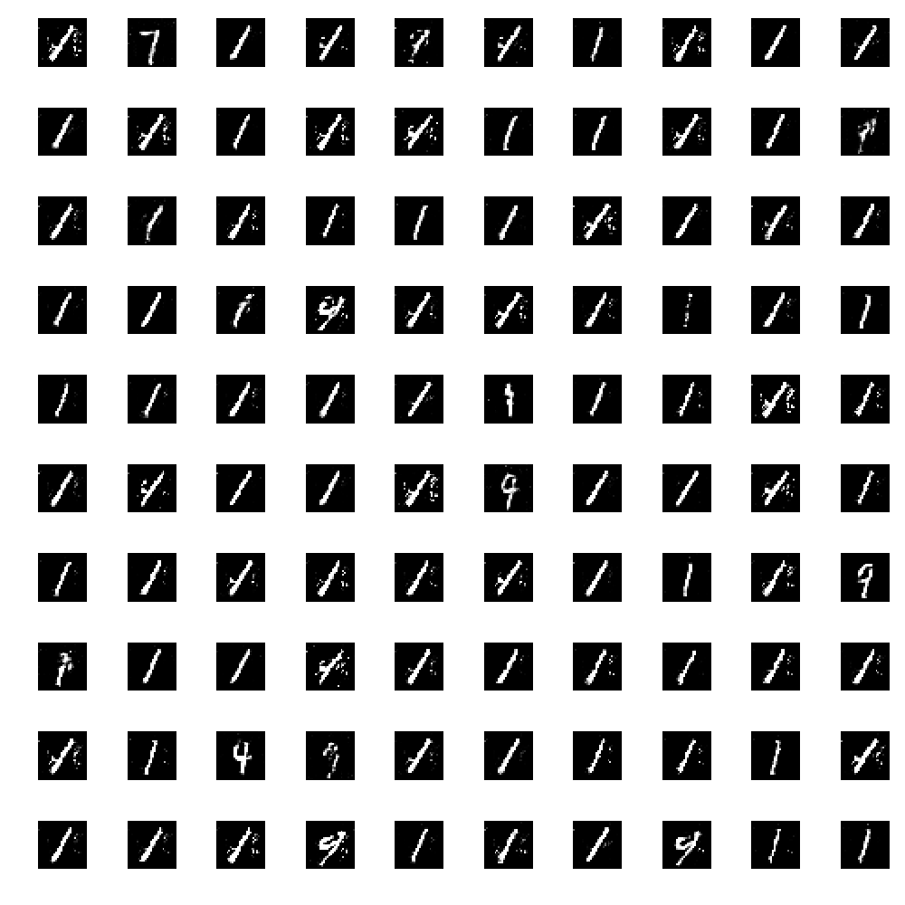

## Learning GANs

This repository is a little collection on learning how to use different GANs on MNIST with Keras. 

#### TODO:

- ~~Dense GAN~~
- ~~CNN GAN~~
- Conditional GAN
- Progressive GANs
- ~~Visualisation~~
- Fix mode collapse

#### Occurring Problems:

**Partial mode collapse.**

Generator tends to generate the similar output or output containing similar features. Example images created with a dense model, seems to be less of an problem with the CNN model.

Potential fixes: 

- https://medium.com/intel-student-ambassadors/reducing-mode-collapse-in-gans-using-guided-latent-spaces-36f52a08a668

**Identify point of convergence:**

Learning rate decay does not seem to improve convergence

#### References:

Code is partly adapted from  [0], Rowel Atienza [1], Jason Bronwlee [2]. Work in progress.

[0]  Renu Khandelwal -https://towardsdatascience.com/gan-by-example-using-keras-on-tensorflow-backend-1a6d515a60d0

[1] Rowel Atienza - https://medium.com/datadriveninvestor/generative-adversarial-network-gan-using-keras-ce1c05cfdfd3

[2]  Jason Bronwlee -  https://machinelearningmastery.com/how-to-develop-a-conditional-generative-adversarial-network-from-scratch/

